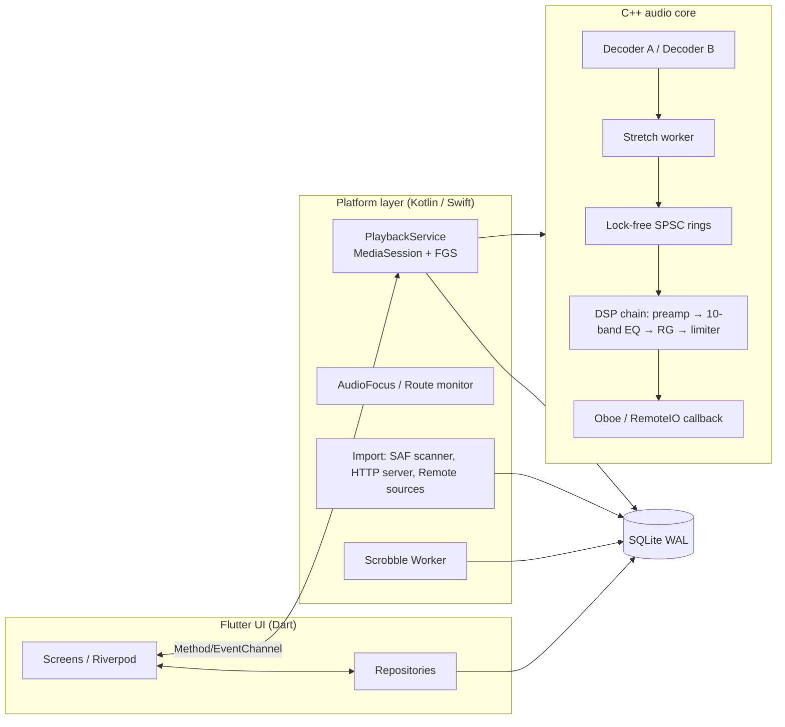
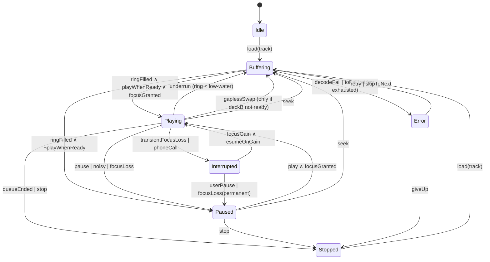
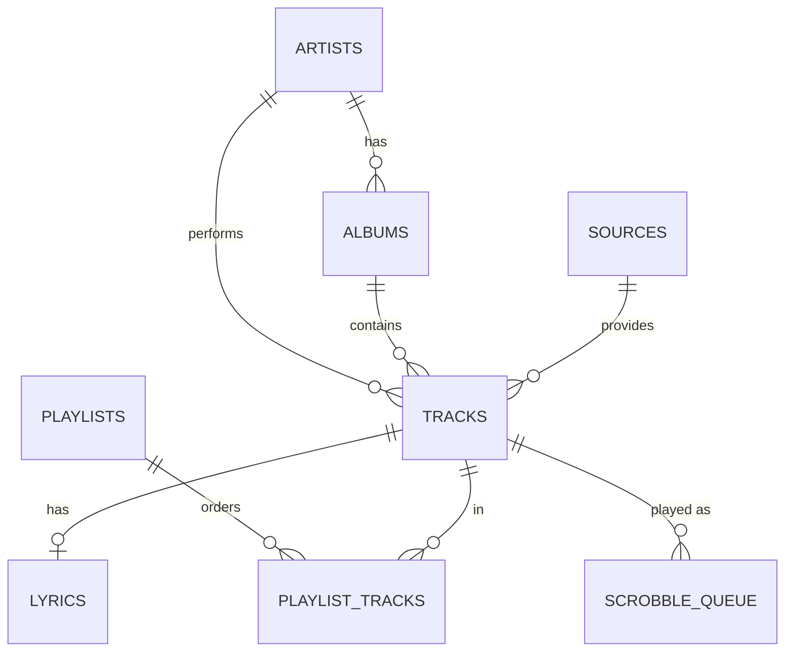

# AuraSound — Technical Design Document

Offline-first music player · Android-first, iOS-compatible · Flutter UI + Kotlin/Swift platform layer + shared C++ audio core

---

## 0. System Architecture Overview

### 0.1 Stack decision

| Layer | Choice | Why |
|---|---|---|
| UI | Flutter (Dart), Riverpod + Drift/SQLite read models | One UI codebase, 120 fps lists |
| Platform services | Kotlin (Media3 `MediaSessionService`) / Swift (AVAudioSession + MPRemoteCommandCenter) | Only native code can own foreground service, focus, lock screen |
| Audio core | C++17 shared lib: decode → DSP → ring buffer → Oboe (Android) / AudioUnit RemoteIO (iOS) | Custom DSP (EQ, R128, stretch) and gapless need sample-level control that ExoPlayer/AVPlayer don't expose |
| Decoding | FFmpeg (LGPL, minimal build: mp3, aac, alac, flac, vorbis, opus, wav, dsf optional) | One decoder for all codecs and seekable via `AVIOContext` on any source |
| Tags | TagLib (C++) via JNI/FFI | Read/write ID3v1/v2, Vorbis Comments, MP4 atoms |
| DB | SQLite (Room on Android side, Drift in Dart — same file, WAL mode) | Relational + FTS5 |
| Loudness | libebur128 | Reference EBU R128 implementation |
| Time-stretch | Signalsmith Stretch (MIT) or Rubber Band R3 (GPL / commercial) | Formant-preserving. **License check required** before choosing Rubber Band |

**Key principle:** the UI never touches audio. The Flutter isolate talks to a `PlaybackController` over a MethodChannel/EventChannel (or FFI for hot paths); the controller lives in the foreground service process and survives the Activity.

### 0.2 Component diagram



### 0.3 Threading model

| Thread | Priority | Rule |
|---|---|---|
| Audio callback (Oboe) | Real-time | No malloc, no locks, no I/O, no logging. Reads ring, runs EQ/limiter, writes output |
| Decoder worker (×2: current + next) | Above normal | Fills ring buffers; owns FFmpeg contexts |
| Stretch worker | Above normal | Runs only when speed ≠ 1.0 or pitch ≠ 0 |
| Service main thread | Normal | Session, notification, state machine |
| IO dispatcher | Background | SAF scans, network, tag writes, DB |

### 0.4 Repository layout

```
aurasound/
├─ app/                  Flutter UI
├─ android/              Kotlin service, importers, workers
├─ ios/                  Swift service
├─ core/                 C++ (engine, dsp, decoder, jni/ffi bindings)
├─ db/schema/            DDL + migrations
└─ docs/
```

---

# MODULE 1 — Persistent Background Audio Engine & Lifecycle

## 1.1 Data flow

```
User tap → Flutter → PlaybackController (service process)
  → state machine validates transition
  → requests AudioFocus (Android) / activates AVAudioSession (iOS)
  → engine.load(deckA, uri) ; engine.preload(deckB, next)
  → Oboe stream start → callback pulls PCM
  → state events → MediaSession / MPNowPlayingInfoCenter + Flutter EventChannel
```

## 1.2 Android foreground service (Kotlin, Media3)

Manifest (Android 13/14 requirements):

```xml
<uses-permission android:name="android.permission.FOREGROUND_SERVICE" />
<uses-permission android:name="android.permission.FOREGROUND_SERVICE_MEDIA_PLAYBACK" />
<uses-permission android:name="android.permission.POST_NOTIFICATIONS" />
<uses-permission android:name="android.permission.WAKE_LOCK" />

<service
    android:name=".playback.PlaybackService"
    android:exported="true"
    android:foregroundServiceType="mediaPlayback">
    <intent-filter>
        <action android:name="androidx.media3.session.MediaSessionService" />
    </intent-filter>
</service>
```

Because the C++ engine replaces ExoPlayer's renderer, wrap it in a Media3 `SimpleBasePlayer` so Media3 handles the notification, session, media-button and Bluetooth/Auto integration for free:

```kotlin
class PlaybackService : MediaSessionService() {
    private lateinit var engine: NativeEngine
    private lateinit var player: AuraPlayer          // SimpleBasePlayer wrapper
    private var session: MediaSession? = null
    private lateinit var focus: FocusController
    private val noisyReceiver = object : BroadcastReceiver() {
        override fun onReceive(c: Context, i: Intent) {
            if (i.action == AudioManager.ACTION_AUDIO_BECOMING_NOISY) player.pause()
        }
    }

    override fun onCreate() {
        super.onCreate()
        engine = NativeEngine(applicationContext)          // loads libaurasound.so
        player = AuraPlayer(engine, PlaybackStateStore(db))
        focus = FocusController(getSystemService(AudioManager::class.java), player)
        player.attachFocus(focus)
        session = MediaSession.Builder(this, player)
            .setSessionActivity(mainActivityPendingIntent())
            .build()
        registerReceiver(noisyReceiver, IntentFilter(AudioManager.ACTION_AUDIO_BECOMING_NOISY))
        lifecycleScope.launch { player.restoreLastSession() }   // crash / kill recovery
    }

    override fun onGetSession(info: MediaSession.ControllerInfo) = session

    override fun onTaskRemoved(rootIntent: Intent?) {
        // Swiping the app away must NOT kill music if playing.
        if (!player.playWhenReady || player.playbackState == Player.STATE_ENDED) stopSelf()
    }

    override fun onTrimMemory(level: Int) {
        if (level >= ComponentCallbacks2.TRIM_MEMORY_RUNNING_CRITICAL) engine.releasePreloadedDeck()
    }

    override fun onDestroy() {
        player.persistNow()
        unregisterReceiver(noisyReceiver)
        session?.release(); engine.shutdown(); super.onDestroy()
    }
}
```

## 1.3 Audio focus policy

| Event | Action |
|---|---|
| `AUDIOFOCUS_LOSS` (other music app, long call) | Pause, abandon focus, state → `Paused`, **do not** auto-resume |
| `LOSS_TRANSIENT` (phone call, voice assistant) | Pause, remember `resumeOnFocusGain=true`, state → `Interrupted` |
| `LOSS_TRANSIENT_CAN_DUCK` (nav prompt, notification) | Ramp gain to 0.2 over 150 ms; restore over 400 ms on gain |
| `GAIN` | If `resumeOnFocusGain` → fade-in 250 ms and resume; else restore volume only |
| `ACTION_AUDIO_BECOMING_NOISY` (headset unplug / BT off) | Pause immediately, **never** auto-resume |
| Headset re-plug | No auto play (user setting: "Resume on headset connect", default off) |

```kotlin
class FocusController(private val am: AudioManager, private val p: AuraPlayer) {
    private var resumeOnGain = false
    private val attrs = AudioAttributes.Builder()
        .setUsage(AudioAttributes.USAGE_MEDIA)
        .setContentType(AudioAttributes.CONTENT_TYPE_MUSIC).build()

    private val listener = AudioManager.OnAudioFocusChangeListener { change ->
        when (change) {
            AudioManager.AUDIOFOCUS_GAIN -> {
                p.engine.rampDuck(1.0f, 400)
                if (resumeOnGain) { resumeOnGain = false; p.resumeFromInterruption() }
            }
            AudioManager.AUDIOFOCUS_LOSS -> { resumeOnGain = false; p.pauseByFocusLoss(); abandon() }
            AudioManager.AUDIOFOCUS_LOSS_TRANSIENT -> {
                resumeOnGain = p.isPlaying; p.interrupt()
            }
            AudioManager.AUDIOFOCUS_LOSS_TRANSIENT_CAN_DUCK -> p.engine.rampDuck(0.2f, 150)
        }
    }
    private val request = AudioFocusRequest.Builder(AudioManager.AUDIOFOCUS_GAIN)
        .setAudioAttributes(attrs).setOnAudioFocusChangeListener(listener)
        .setWillPauseWhenDucked(false).build()

    fun request(): Boolean = am.requestAudioFocus(request) == AudioManager.AUDIOFOCUS_REQUEST_GRANTED
    fun abandon() = am.abandonAudioFocusRequest(request)
}
```

## 1.4 iOS equivalent (Swift)

```swift
final class PlaybackController {
    private let session = AVAudioSession.sharedInstance()

    func configure() throws {
        try session.setCategory(.playback, mode: .default, options: [])   // + UIBackgroundModes: audio
        NotificationCenter.default.addObserver(self, selector: #selector(onInterruption),
            name: AVAudioSession.interruptionNotification, object: session)
        NotificationCenter.default.addObserver(self, selector: #selector(onRoute),
            name: AVAudioSession.routeChangeNotification, object: session)
        let rc = MPRemoteCommandCenter.shared()
        rc.playCommand.addTarget { [weak self] _ in self?.play(); return .success }
        rc.pauseCommand.addTarget { [weak self] _ in self?.pause(); return .success }
        rc.nextTrackCommand.addTarget { [weak self] _ in self?.next(); return .success }
        rc.changePlaybackPositionCommand.addTarget { [weak self] e in
            self?.seek((e as! MPChangePlaybackPositionCommandEvent).positionTime); return .success }
    }

    @objc func onInterruption(_ n: Notification) {
        guard let raw = n.userInfo?[AVAudioSessionInterruptionTypeKey] as? UInt,
              let type = AVAudioSession.InterruptionType(rawValue: raw) else { return }
        switch type {
        case .began: machine.send(.interrupt)
        case .ended:
            let opts = AVAudioSession.InterruptionOptions(
                rawValue: n.userInfo?[AVAudioSessionInterruptionOptionKey] as? UInt ?? 0)
            if opts.contains(.shouldResume) { machine.send(.resumeFromInterruption) }
        @unknown default: break
        }
    }

    @objc func onRoute(_ n: Notification) {
        let reason = (n.userInfo?[AVAudioSessionRouteChangeReasonKey] as? UInt)
            .flatMap(AVAudioSession.RouteChangeReason.init(rawValue:))
        if reason == .oldDeviceUnavailable { machine.send(.pause) }        // headphones unplugged
    }

    func publishNowPlaying(_ t: Track, position: TimeInterval, rate: Float) {
        MPNowPlayingInfoCenter.default().nowPlayingInfo = [
            MPMediaItemPropertyTitle: t.title, MPMediaItemPropertyArtist: t.artist,
            MPMediaItemPropertyAlbumTitle: t.album,
            MPMediaItemPropertyPlaybackDuration: t.duration,
            MPNowPlayingInfoPropertyElapsedPlaybackTime: position,
            MPNowPlayingInfoPropertyPlaybackRate: rate
        ]
    }
}
```

## 1.5 Playback state machine

States: `Idle · Buffering · Playing · Paused · Stopped · Error · Interrupted`



```kotlin
sealed interface PState {
    data object Idle : PState; data object Buffering : PState; data object Playing : PState
    data object Paused : PState; data object Stopped : PState; data object Interrupted : PState
    data class Error(val cause: PlaybackError, val recoverable: Boolean) : PState
}
enum class PEvent { Load, Ready, Play, Pause, Underrun, Interrupt, FocusGain, Stop, Fail, Retry, Ended, Noisy }

class PlaybackStateMachine(private val sink: (PState, PState) -> Unit) {
    @Volatile var state: PState = PState.Idle; private set
    private var playWhenReady = false

    @Synchronized fun send(e: PEvent, err: PlaybackError? = null) {
        val from = state
        val to: PState = when (from to e) {
            PState.Idle to PEvent.Load, PState.Stopped to PEvent.Load       -> PState.Buffering
            PState.Buffering to PEvent.Ready -> if (playWhenReady) PState.Playing else PState.Paused
            PState.Playing to PEvent.Underrun, PState.Paused to PEvent.Load -> PState.Buffering
            PState.Playing to PEvent.Pause, PState.Playing to PEvent.Noisy  -> { playWhenReady = false; PState.Paused }
            PState.Paused to PEvent.Play                                    -> { playWhenReady = true; PState.Playing }
            PState.Playing to PEvent.Interrupt                              -> PState.Interrupted
            PState.Interrupted to PEvent.FocusGain                          -> PState.Playing
            PState.Interrupted to PEvent.Pause                              -> { playWhenReady = false; PState.Paused }
            PState.Playing to PEvent.Ended                                  -> PState.Stopped
            PState.Buffering to PEvent.Fail                                 -> PState.Error(err!!, recoverable = true)
            PState.Error(err ?: PlaybackError.Unknown, true) to PEvent.Retry -> PState.Buffering
            else -> if (e == PEvent.Stop) PState.Stopped else from            // illegal transitions are no-ops + logged
        }
        if (to != from) { state = to; sink(from, to) }
    }
}
```

**Propagation:** the `sink` fans out to (1) `MediaSession` via `SimpleBasePlayer.invalidateState()` → notification + lock screen + Bluetooth metadata, (2) Flutter `EventChannel("aurasound/state")`, (3) `PlaybackStateStore` (debounced 1 s write of `queue`, `index`, `positionMs`, `speed`), (4) scrobbler play-time accumulator.

## 1.6 Native engine: Oboe + dual-deck gapless

"Dual-player pre-buffering" is implemented as **two decoder pipelines feeding one output stream**. There is never a second audio stream, so the swap is sample-accurate (no device reopen click).

```cpp
// core/engine/engine.h
class Deck {
 public:
  bool open(std::unique_ptr<AVSource> src);         // FFmpeg AVFormatContext on fd/http/cache source
  size_t read(float* dst, size_t frames);            // pulls from ring, returns frames available
  bool   eof() const { return eofReached_ && ring_.empty(); }
  int64_t trimStartFrames_ = 0, trimEndFrames_ = 0;  // encoder delay/padding (LAME / iTunSMPB / OpusHead)
 private:
  SpscRing<float> ring_{ /*seconds*/ 4 * 48000 * 2 };
  std::thread worker_; std::atomic<bool> eofReached_{false};
};

class Engine : public oboe::AudioStreamDataCallback {
 public:
  oboe::DataCallbackResult onAudioReady(oboe::AudioStream*, void* out, int32_t frames) override {
    auto* dst = static_cast<float*>(out);
    size_t got = current_->read(dst, frames);
    if (got < (size_t)frames) {
      if (current_->eof()) {                         // ---- gapless boundary ----
        if (next_ && next_->readyForSwap()) {
          size_t rest = next_->read(dst + got * 2, frames - got);   // fill remainder from deck B
          got += rest;
          std::swap(current_, next_);
          events_.push(Ev::TrackChanged);            // lock-free queue → service thread
          next_.reset();                              // service thread will preload the next-next
        } else if (!next_) { events_.push(Ev::QueueEnded); return oboe::DataCallbackResult::Stop; }
      } else { events_.push(Ev::Underrun); }
      std::fill(dst + got * 2, dst + frames * 2, 0.f);
    }
    dsp_.process(dst, frames);                       // preamp → EQ → RG → limiter (in-place)
    duck_.apply(dst, frames);                        // focus duck ramp
    positionFrames_.fetch_add(got, std::memory_order_relaxed);
    return oboe::DataCallbackResult::Continue;
  }
 private:
  std::unique_ptr<Deck> current_, next_;
  DspChain dsp_; DuckRamp duck_; LockFreeQueue<Ev> events_;
  std::atomic<int64_t> positionFrames_{0};
};

// Stream config for low latency + battery: 
// PerformanceMode::PowerSaving when screen off & no BT (bigger buffer, fewer wakeups),
// LowLatency only for seek-preview / DJ modes. Music playback doesn't need <20 ms.
oboe::AudioStreamBuilder b;
b.setDirection(oboe::Direction::Output)->setFormat(oboe::AudioFormat::Float)
 ->setChannelCount(2)->setSampleRate(48000)->setSampleRateConversionQuality(oboe::SampleRateConversionQuality::Medium)
 ->setPerformanceMode(oboe::PerformanceMode::PowerSaving)
 ->setSharingMode(oboe::SharingMode::Shared)->setUsage(oboe::Usage::Media)
 ->setContentType(oboe::ContentType::Music)->setDataCallback(&engine);
```

**Preload trigger:** when `remaining(current) < 10 s` (or immediately if the next track is on a slow source), the service thread calls `engine.preload(nextUri)`; decoding begins into deck B's ring. Encoder delay/padding is trimmed from head/tail so MP3/AAC albums (live albums, DJ mixes) are truly gapless. Optional crossfade (0–12 s) reuses the same two decks with an equal-power gain curve.

**Sample-rate policy:** output stream is fixed at the device's native rate (usually 48 kHz). Each deck resamples on the decoder thread (`swresample`, SoX-quality `filter_size=32`), so track-to-track rate changes never reopen the stream.

## 1.7 Edge cases — Module 1

| Case | Strategy |
|---|---|
| Corrupted/truncated file | Decoder returns `AVERROR_INVALIDDATA` → skip bad packet up to 50 consecutive; if exceeded → `Error(recoverable=true)`; auto-advance after 1.5 s, mark `tracks.is_corrupt=1`, surface "Skipped: <title>" |
| OS kills service under memory pressure | `onTrimMemory` frees deck B; state persisted ≤1 s old; on restart via media-button / Android Auto / notification, `restoreLastSession()` reloads queue + position (Media3 playback resumption `onPlaybackResumption`) |
| Android 12+ FGS-start-from-background exception | Only start FGS from a user gesture or `MediaSession` controller connect; never from `WorkManager` |
| Audio device change mid-play (BT → speaker) | Oboe `onErrorAfterClose` → reopen stream, keep decoder rings, resume within ~50 ms; treat "noisy" separately to pause |
| Underrun on network stream | Low-water mark 1.0 s → `Buffering`, high-water 3.0 s to resume; show spinner in notification |
| Focus request denied | State stays `Paused`; toast "Another app is using audio" |
| Call during pause | `resumeOnGain` false → stays paused |
| Battery saver / Doze | `PARTIAL_WAKE_LOCK` only while `Playing`; `setWakeMode` for network sources; release on pause after 30 s |
| Seek in VBR MP3 without Xing | Build coarse seek table on first scan (store in `tracks.seek_index` blob) or fall back to `av_seek_frame` any-frame + decode-discard |
| Rapid track skipping | Engine `load()` cancels in-flight decoder via generation token; ring reset is atomic |

---

# MODULE 2 — File Import & Network Streaming Pipeline

## 2.1 Data flow

```
Source (SAF tree | WiFi upload | USB/OTG | WebDAV | SMB | Drive/OneDrive)
   └─► SourceAdapter.list()/open() ─► ScanPipeline
          ├─ diff vs DB (path+size+mtime → skip unchanged)
          ├─ TagReader (TagLib on fd, first 512 KB only)
          ├─ ArtworkExtractor (embedded → cache/webp)
          └─► batched Room upserts (500 rows / tx) ─► Flow → UI (progressive)
```

## 2.2 SAF background scanner (no UI freeze)

Avoid `DocumentFile.listFiles()` (one IPC per child). Query `DocumentsContract` children directly:

```kotlin
class SafScanner(private val cr: ContentResolver, private val db: LibraryDao) {
    private val audioExt = setOf("mp3","flac","m4a","aac","ogg","opus","wav","aiff","wma","alac","dsf")

    fun scan(treeUri: Uri, sourceId: Long): Flow<ScanProgress> = channelFlow {
        val root = DocumentsContract.buildDocumentUriUsingTree(treeUri,
                     DocumentsContract.getTreeDocumentId(treeUri))
        val stack = ArrayDeque<String>().apply { addLast(DocumentsContract.getTreeDocumentId(treeUri)) }
        val batch = ArrayList<RawFile>(500); var seen = 0

        while (stack.isNotEmpty()) {
            ensureActive()
            val parent = stack.removeLast()
            val children = DocumentsContract.buildChildDocumentsUriUsingTree(treeUri, parent)
            cr.query(children, arrayOf(
                Document.COLUMN_DOCUMENT_ID, Document.COLUMN_DISPLAY_NAME,
                Document.COLUMN_MIME_TYPE, Document.COLUMN_SIZE, Document.COLUMN_LAST_MODIFIED),
                null, null, null)?.use { c ->
                while (c.moveToNext()) {
                    val id = c.getString(0); val name = c.getString(1); val mime = c.getString(2)
                    if (mime == Document.MIME_TYPE_DIR) { if (!name.startsWith(".")) stack.addLast(id); continue }
                    if (name.substringAfterLast('.', "").lowercase() !in audioExt && !mime.startsWith("audio/")) continue
                    batch += RawFile(DocumentsContract.buildDocumentUriUsingTree(treeUri, id).toString(),
                                     name, c.getLong(3), c.getLong(4))
                    if (batch.size == 500) { flush(batch, sourceId); send(ScanProgress(++seen * 500)); batch.clear() }
                }
            }
        }
        flush(batch, sourceId)
        db.markMissing(sourceId, scanStartedAt)          // tombstone files no longer present
        send(ScanProgress.done())
    }.flowOn(Dispatchers.IO).buffer(Channel.CONFLATED)

    private suspend fun flush(b: List<RawFile>, sourceId: Long) {
        val fresh = db.filterChanged(sourceId, b)        // path+size+mtime unchanged → skipped
        val parsed = fresh.chunked(16).flatMap { chunk -> coroutineScope {
            chunk.map { async(Dispatchers.Default) { TagReader.read(cr, it) } }.awaitAll() } }
        db.upsertTracks(parsed)                          // single transaction
    }
}
```

Persist access: `contentResolver.takePersistableUriPermission(uri, FLAG_GRANT_READ_URI_PERMISSION or FLAG_GRANT_WRITE_URI_PERMISSION)`. Register a `ContentObserver` on the tree for live updates, plus a weekly `WorkManager` rescan.

**Native playback from `content://`:** `ParcelFileDescriptor pfd = cr.openFileDescriptor(uri, "r"); int fd = pfd.detachFd();` → pass fd to C++; FFmpeg opens via a custom `AVIOContext` (`read/seek` on the fd). Engine owns and closes the fd.

## 2.3 WiFi Transfer (embedded HTTP server)

```kotlin
class WifiTransferServer(private val ctx: Context, private val importer: FileImporter) {
    private var engine: ApplicationEngine? = null
    val pin = (100000..999999).random().toString()
    private val token = UUID.randomUUID().toString()

    fun start(port: Int = 8899): String {
        engine = embeddedServer(CIO, port = port, host = "0.0.0.0") {
            install(ContentNegotiation) { json() }
            intercept(ApplicationCallPipeline.Plugins) {                  // auth for every call except '/' and '/auth'
                if (call.request.path() !in setOf("/", "/auth") && call.request.header("X-Token") != token) {
                    call.respond(HttpStatusCode.Unauthorized); finish() }
            }
            routing {
                get("/") { call.respondText(webDashboardHtml(), ContentType.Text.Html) }   // bundled drag-and-drop SPA
                post("/auth") { if (call.receive<Map<String,String>>()["pin"] == pin) call.respond(mapOf("token" to token))
                                else call.respond(HttpStatusCode.Forbidden) }
                get("/api/library") { call.respond(importer.listImported()) }
                post("/api/upload") {                                                        // streamed multipart, no full buffering
                    call.receiveMultipart().forEachPart { part ->
                        if (part is PartData.FileItem) {
                            val safeName = sanitize(part.originalFileName ?: "upload.bin")   // strip ../ and control chars
                            part.streamProvider().use { importer.write(safeName, it) }       // to app-scoped dir / MediaStore
                        }
                        part.dispose()
                    }
                    call.respond(HttpStatusCode.Created)
                }
            }
        }.start(wait = false)
        return "http://${localIpv4()}:$port"
    }
    fun stop() { engine?.stop(500, 1000) }
}
```

Discovery: display URL + QR + 6-digit PIN; advertise `_aurasound._tcp` via NSD/mDNS (`http://aurasound.local`). Security: bind only while the "Wi-Fi Transfer" screen is open (foreground FGS type `dataSync`), PIN + per-session token, 2 GB per-file cap, extension whitelist, rate-limit failed PINs (5 tries → 60 s lock), plain HTTP on LAN by default with optional self-signed TLS. **iOS:** servers cannot run in the background; keep the screen awake and run only in foreground.

## 2.4 OTG / external storage

- Android exposes USB mass storage and SD cards as document providers → same SAF scanner; sources table records `kind='usb'`. Handle `ACTION_MEDIA_MOUNTED/UNMOUNTED` and `UsbManager` attach/detach: mark tracks `availability='offline_media'`, never delete them; grey out in UI; re-attach re-validates by path + size.
- If unmounted mid-play: engine gets `EIO` → treat as `ioFail`, pause with message "Drive disconnected", keep queue.
- iOS: `UIDocumentPickerViewController` with security-scoped bookmarks (`startAccessingSecurityScopedResource`), stored in DB as bookmark data.

## 2.5 Remote source layer

```kotlin
interface RemoteSource {
    suspend fun list(path: String): List<RemoteEntry>
    suspend fun stat(path: String): RemoteEntry
    fun openRange(path: String, offset: Long, length: Long?): InputStream   // must support ranged reads
    suspend fun close()
}
class WebDavSource(client: OkHttpClient, base: HttpUrl, creds: Credentials) : RemoteSource   // PROPFIND depth:1, Range GET
class SmbSource(host: String, share: String, auth: AuthenticationContext) : RemoteSource       // smbj, SMB2/3 only, no SMB1
class DriveSource(tokenProvider: OAuthTokenProvider) : RemoteSource                             // files.get?alt=media + Range
class OneDriveSource(tokenProvider: OAuthTokenProvider) : RemoteSource                         // /me/drive/items/{id}/content
```

Credentials in Android Keystore / iOS Keychain (`EncryptedSharedPreferences`), OAuth via AppAuth with PKCE. Remote tracks are indexed like local ones (tags read from the first ~256 KB + last 128 bytes for ID3v1) and marked `source_id` ≠ local.

## 2.6 Offline cache engine

**Design:** sparse file per track + chunk bitmap; the decoder reads through a `CachingDataSource` so playback starts after the first chunks arrive while the rest downloads.

```
cache/
  ab/12cd….part      sparse file, size = track size
  ab/12cd….meta      { etag, size, chunkSize=262144, bitmap, lastAccess }
```

```kotlin
class CachingDataSource(private val remote: RemoteSource, private val store: ChunkStore) : DataSource {
    override fun read(buf: ByteArray, off: Int, len: Int): Int {
        val chunk = (pos / CHUNK).toInt()
        if (!store.has(key, chunk)) {
            prefetchWindow(chunk, ahead = 8)          // Range GET of 2 MB; dedup in-flight requests
            store.await(key, chunk, timeoutMs = 8_000) ?: throw IOException("chunk timeout")
        }
        return store.read(key, pos, buf, off, len).also { pos += it }
    }
}

class QuotaManager(private val maxBytes: Long, private val dao: CacheDao) {
    suspend fun ensureSpace(need: Long) {
        while (dao.totalBytes() + need > maxBytes) {
            val victim = dao.lruUnpinned() ?: throw QuotaExceeded()      // pinned = "Download for offline"
            store.delete(victim); dao.remove(victim.key)
        }
    }
}
```

- **Modes:** *stream cache* (auto, LRU, default 2 GB, user-set 256 MB–unlimited) and *pinned downloads* (playlist/album, never evicted, Wi-Fi-only toggle).
- **Validation:** `ETag`/`Last-Modified` change → invalidate bitmap.
- **Offline fallback:** `ConnectivityManager.NetworkCallback`; if offline, the queue builder filters to `cached_full OR local`; unavailable tracks are shown dimmed and auto-skipped with a snackbar. Partially cached tracks play up to the cached range, then `Buffering → Error(offline)`.
- **Storage pressure:** check `StatFs` free space; refuse download if free < max(500 MB, 5%).
- Downloads run in `WorkManager` (`setRequiredNetworkType(UNMETERED)` optional, expedited for the track being played).

## 2.7 Edge cases — Module 2

| Case | Strategy |
|---|---|
| 100k-file library | Incremental diff scan, batched tx, `WAL`, UI reads from paged queries; first results visible in <2 s |
| SAF permission revoked | `persistedUriPermissions` audit at start; source flagged `needs_reauth`; tracks kept, playback disabled until re-grant |
| Duplicate imports | `content_hash = xxh3(first 64KB + size + duration)` unique per library; upload dedup returns existing track id |
| Filename encodings / non-UTF-8 ID3v1 | Detect with ICU charset detector; fall back to Windows-1252 / Shift-JIS / GBK heuristics; user override per track |
| Server timeouts / flaky Wi-Fi | Exponential backoff (1 s→30 s, 5 attempts), resume by Range; chunk store already durable |
| SMB/WebDAV cert problems | Pin on first use with user confirmation (TOFU); never silently accept |
| Zip-slip / path traversal on upload | Sanitize name, write only via `importer.write` into app-scoped dir |

---

# MODULE 3 — Audio Processing & DSP Engine

## 3.1 Pipeline

```
Decoder (float32, device rate)
  → [Stretch/Pitch worker, only if tempo≠1 or pitch≠0]     (producer thread)
  → ring buffer
  → Callback:  ReplayGain/R128 gain → EQ preamp → 10× biquad (per channel) → lookahead limiter → duck → Oboe out
```

All parameter changes are pushed as immutable snapshots through a lock-free single-slot mailbox (`std::atomic<Params*>` swap); the audio thread picks up the new snapshot at the next block and **smooths** coefficients over 512 samples to avoid zipper noise.

## 3.2 Parametric 10-band EQ

Bands (Hz): **31, 62, 125, 250, 500, 1k, 2k, 4k, 8k, 16k** · gain −12…+12 dB · Q 0.3…10 (default 1.41) · per-band type: peaking (default), low-shelf (band 1), high-shelf (band 10). Coefficients follow the RBJ Audio-EQ Cookbook; each band is a Direct-Form-II-Transposed biquad in `float` (state in `double` for the 31 Hz band to avoid low-frequency quantization noise).

```cpp
struct BiquadCoef { double b0,b1,b2,a1,a2; };

BiquadCoef peaking(double fs, double f0, double gainDb, double Q) {
  const double A  = std::pow(10.0, gainDb / 40.0);
  const double w0 = 2.0 * M_PI * f0 / fs, cw = std::cos(w0), alpha = std::sin(w0) / (2.0 * Q);
  const double a0 = 1 + alpha / A;
  return { (1 + alpha * A) / a0, (-2 * cw) / a0, (1 - alpha * A) / a0,
           (-2 * cw) / a0,       (1 - alpha / A) / a0 };
}

class Biquad {                          // TDF-II, one instance per band per channel
  double z1 = 0, z2 = 0; BiquadCoef c{1,0,0,0,0}, target{1,0,0,0,0}; int ramp = 0;
 public:
  void setTarget(const BiquadCoef& t) { target = t; ramp = 512; }
  inline float process(float x) {
    if (ramp > 0) { lerpCoefs(c, target, ramp--); }
    double y = c.b0 * x + z1;
    z1 = c.b1 * x - c.a1 * y + z2;
    z2 = c.b2 * x - c.a2 * y;
    return (float)y;
  }
};

class Equalizer {
  static constexpr int N = 10; Biquad bands[N][2];   // [band][channel]
  float preamp = 1.f;
 public:
  void configure(const EqParams& p, double fs) {
    float maxBoost = 0; for (auto& b : p.bands) maxBoost = std::max(maxBoost, b.gainDb);
    preamp = std::pow(10.f, -(maxBoost + p.userPreampDb) / 20.f) ;   // auto-headroom: never clip on boost
    for (int i = 0; i < N; ++i) for (int ch = 0; ch < 2; ++ch)
      bands[i][ch].setTarget(makeCoef(p.bands[i], fs));            // skip (identity) if |gain| < 0.05 dB
  }
  void process(float* interleaved, int frames) {
    for (int n = 0; n < frames; ++n) for (int ch = 0; ch < 2; ++ch) {
      float s = interleaved[n * 2 + ch] * preamp;
      for (int b = 0; b < N; ++b) if (active[b]) s = bands[b][ch].process(s);
      interleaved[n * 2 + ch] = s;
    }
  }
};
```

Bypass = crossfade dry/wet over 20 ms. Denormals: set FTZ/DAZ (`_MM_SET_FLUSH_ZERO_MODE` / ARM `FPCR.FZ`) on the audio thread. CPU cost ≈ 20 biquads × 96k samples/s ≈ negligible on a phone.

## 3.3 AutoEQ integration (4000+ headphone profiles)

AutoEQ publishes results per headphone (parametric filters as `ParametricEQ.txt`, plus graphic EQ and FixedBandEQ). AuraSound normalizes them into one JSON schema and ships an **index**, not 4000 profiles.

Normalized profile:

```json
{
  "schema": 1,
  "name": "Sennheiser HD 600",
  "source": "oratory1990",
  "target": "harman_over-ear_2018",
  "preamp_db": -6.2,
  "filters": [
    { "type": "LSC", "fc": 105,  "gain_db":  4.1, "q": 0.70 },
    { "type": "PK",  "fc": 250,  "gain_db": -2.3, "q": 1.10 },
    { "type": "PK",  "fc": 3300, "gain_db":  3.0, "q": 2.40 },
    { "type": "HSC", "fc": 10000,"gain_db": -3.5, "q": 0.70 }
  ]
}
```

Ingest pipeline:

1. App ships `autoeq_index.sqlite` (name, brand, form factor, source, target, size) — FTS5 search.
2. On selection, download `profiles/<id>.json` (or convert `ParametricEQ.txt` on device) → cache.
3. Apply: if all filters map onto the 10 bands within ±⅓ octave → snap to bands; otherwise run in **"Advanced mode"** with up to 16 arbitrary cascaded biquads (`Equalizer::configureFree`).

```dart
// Parse AutoEQ ParametricEQ.txt lines like:
// Preamp: -6.2 dB
// Filter 1: ON PK Fc 250 Hz Gain -2.3 dB Q 1.10
final _filterRe = RegExp(
  r'Filter\s+\d+:\s+ON\s+(PK|LSC|HSC)\s+Fc\s+([\d.]+)\s*Hz\s+Gain\s+(-?[\d.]+)\s*dB(?:\s+Q\s+([\d.]+))?',
  caseSensitive: false);

EqProfile parseAutoEq(String name, String txt) {
  final pre = RegExp(r'Preamp:\s*(-?[\d.]+)\s*dB').firstMatch(txt);
  final filters = _filterRe.allMatches(txt).map((m) => EqFilter(
      type: m[1]!.toUpperCase(),
      fc: double.parse(m[2]!),
      gainDb: double.parse(m[3]!).clamp(-24.0, 24.0),
      q: m[4] != null ? double.parse(m[4]!) : 0.707)).toList();
  if (filters.isEmpty) throw FormatException('No filters in AutoEQ profile');
  return EqProfile(name: name, preampDb: pre != null ? double.parse(pre[1]!) : 0, filters: filters);
}
```

Validation: reject `fc` outside 10–20000 Hz or ≥ 0.45·fs, `q` outside 0.1–20, NaN/Inf; cap total filters (16); apply the profile's preamp *plus* our auto-headroom check.

## 3.4 ReplayGain & EBU R128

- **Read** existing `REPLAYGAIN_TRACK_GAIN/PEAK` and `R128_TRACK_GAIN` (Opus) tags first; only analyze if missing.
- **Analyze** in background (`WorkManager`, charging + idle preferred) with libebur128: K-weighting, gated integrated loudness (−70 LUFS absolute, −10 LU relative gate), true-peak mode.
- **Targets:** EBU R128 = −23 LUFS; ReplayGain 2.0 = −18 LUFS (default for music); streaming-like −14 LUFS optional.
- **Gain** = target − measured, clamped to ±15 dB, and reduced so `peak × gain ≤ 0 dBTP` unless the limiter is enabled ("prevent clipping" setting).

```cpp
#include <ebur128.h>

struct LoudnessResult { double lufs, truePeak, lra; };

LoudnessResult analyze(AVSource& src) {
  ebur128_state* st = ebur128_init(2, 48000, EBUR128_MODE_I | EBUR128_MODE_TRUE_PEAK | EBUR128_MODE_LRA);
  std::vector<float> buf(4096 * 2);
  while (size_t n = src.decodeFloatStereo48k(buf.data(), 4096))
    ebur128_add_frames_float(st, buf.data(), n);
  LoudnessResult r{};
  ebur128_loudness_global(st, &r.lufs);
  double l, rr; ebur128_true_peak(st, 0, &l); ebur128_true_peak(st, 1, &rr);
  r.truePeak = std::max(l, rr);
  ebur128_loudness_range(st, &r.lra);
  ebur128_destroy(&st);
  return r;
}
// tracks.replay_gain (dB) = target - r.lufs ; tracks.peak = r.truePeak ; albums.replay_gain from album-mode analysis
```

**Dynamic range control:** a simple feed-forward compressor (threshold −18 dBFS, ratio 2:1–4:1, attack 10 ms, release 150 ms, soft knee 6 dB) as the "Night mode" preset, followed by a 1.5 ms lookahead brick-wall limiter at −1 dBTP as the final safety stage.

## 3.5 Pitch shift & time-stretch (0.5×–2.0×)

Independent **tempo** (0.5–2.0) and **pitch** (±12 semitones), with **formant preservation** for vocals.

| Engine | Quality | License | CPU |
|---|---|---|---|
| Signalsmith Stretch | Very good, formant-aware | MIT | Low–mid |
| Rubber Band R3 (`OptionEngineFiner`, `OptionFormantPreserved`, `OptionWindowShort` for transients) | Best | GPLv2+ / commercial | Mid–high |
| SoundTouch | Fair, no formant handling | LGPL | Low |

Recommendation: **Signalsmith Stretch** by default (license-safe for a closed-source app); offer Rubber Band only if a commercial license is purchased.

```cpp
class StretchStage {
  signalsmith::stretch::SignalsmithStretch<float> st;
 public:
  void configure(int ch, float fs) { st.presetDefault(ch, fs); }
  void set(float tempo, float pitchSemis, bool formant) {
    st.setTransposeSemitones(pitchSemis);
    if (formant) st.setFormantFactor(std::pow(2.0f, -pitchSemis / 12.0f)); // keep vocal timbre
    tempo_ = std::clamp(tempo, 0.5f, 2.0f);
  }
  // producer side: needs inputFrames = outputFrames * tempo_
  size_t process(const float* in, size_t inFrames, float* out, size_t outFrames) {
    const float* inp[2] = { in, in + inFrames }; float* outp[2] = { out, out + outFrames };
    st.process(inp, (int)inFrames, outp, (int)outFrames); return outFrames;
  }
};
```

Position reporting must multiply by tempo (`mediaPositionMs = outputFrames × tempo / fs`), and `PlaybackParameters.speed` is reported to MediaSession so lock-screen scrubber stays correct. Latency of the stretcher (≈ 60–120 ms) is added to seek/resume; hide it by pre-rolling the ring.

## 3.6 Edge cases — Module 3

| Case | Strategy |
|---|---|
| EQ boost causes clipping | Auto-preamp = −max(boost) plus limiter; show "headroom −X dB" in UI |
| Filter instability at high Q / low fc | Clamp Q by frequency (Q ≤ 6 below 60 Hz), use double state, unit-test poles inside unit circle |
| Sample-rate change | Recompute all coefficients per stream rate; recalc on `onStreamRestarted` |
| Mono / multichannel files | Downmix to stereo in decoder (ITU-R BS.775 coefficients) before DSP |
| DSD / >96 kHz hi-res | Decoder-side resample to device rate; DSD→PCM 176.4 kHz then decimate; warn on low-power devices |
| Analysis of 10k tracks | Queue with backoff, pausable, progress in notification, skip on battery <20% |
| Malformed AutoEQ file | Schema validation errors shown inline; never applies partial profile |
| CPU spikes with stretch on old devices | Adaptive: drop to SoundTouch mode when callback load > 60% (measure `getXRunCount` + timing) |

---

# MODULE 4 — Local Storage, Schema & Metadata Manager

## 4.1 Entity-relationship



## 4.2 DDL (SQLite 3.35+, `PRAGMA journal_mode=WAL; foreign_keys=ON; user_version=1`)

```sql
CREATE TABLE sources (
  id            INTEGER PRIMARY KEY,
  kind          TEXT NOT NULL CHECK (kind IN ('saf','usb','wifi','webdav','smb','gdrive','onedrive')),
  display_name  TEXT NOT NULL,
  root_uri      TEXT NOT NULL,
  needs_reauth  INTEGER NOT NULL DEFAULT 0,
  last_scan_at  INTEGER,
  UNIQUE (kind, root_uri)
);

CREATE TABLE artists (
  id            INTEGER PRIMARY KEY,
  name          TEXT NOT NULL,
  sort_name     TEXT,
  mbid          TEXT,
  UNIQUE (name COLLATE NOCASE)
);

CREATE TABLE albums (
  id            INTEGER PRIMARY KEY,
  title         TEXT NOT NULL,
  album_artist_id INTEGER REFERENCES artists(id) ON DELETE SET NULL,
  year          INTEGER,
  track_total   INTEGER,
  cover_path    TEXT,
  replay_gain   REAL,                 -- album gain, dB
  peak          REAL,
  UNIQUE (title COLLATE NOCASE, album_artist_id)
);

CREATE TABLE tracks (
  id              INTEGER PRIMARY KEY,
  source_id       INTEGER NOT NULL REFERENCES sources(id) ON DELETE CASCADE,
  file_path       TEXT NOT NULL,      -- content:// URI, absolute path, or remote path
  file_size       INTEGER NOT NULL,
  file_mtime      INTEGER NOT NULL,
  content_hash    TEXT,
  title           TEXT NOT NULL,
  artist_id       INTEGER REFERENCES artists(id) ON DELETE SET NULL,
  album_id        INTEGER REFERENCES albums(id)  ON DELETE SET NULL,
  genre           TEXT,
  year            INTEGER,
  track_no        INTEGER,
  disc_no         INTEGER,
  duration_ms     INTEGER NOT NULL,
  bit_rate        INTEGER,            -- kbps
  sample_rate     INTEGER,
  bit_depth       INTEGER,
  channels        INTEGER,
  codec           TEXT,               -- mp3|flac|aac|alac|opus|vorbis|wav|...
  replay_gain     REAL,               -- track gain, dB
  peak            REAL,               -- linear true peak
  rating          INTEGER CHECK (rating BETWEEN 0 AND 5),
  play_count      INTEGER NOT NULL DEFAULT 0,
  skip_count      INTEGER NOT NULL DEFAULT 0,
  last_played_at  INTEGER,            -- epoch ms
  added_at        INTEGER NOT NULL,
  availability    TEXT NOT NULL DEFAULT 'ok' CHECK (availability IN ('ok','missing','offline_media','corrupt')),
  seek_index      BLOB,
  UNIQUE (source_id, file_path)
);
CREATE INDEX idx_tracks_artist  ON tracks(artist_id);
CREATE INDEX idx_tracks_album   ON tracks(album_id, disc_no, track_no);
CREATE INDEX idx_tracks_genre   ON tracks(genre);
CREATE INDEX idx_tracks_played  ON tracks(last_played_at);
CREATE INDEX idx_tracks_hash    ON tracks(content_hash);

CREATE VIRTUAL TABLE tracks_fts USING fts5(
  title, artist, album, genre, content='', tokenize='unicode61 remove_diacritics 2'
);

CREATE TABLE playlists (
  id          INTEGER PRIMARY KEY,
  name        TEXT NOT NULL,
  created_at  INTEGER NOT NULL,
  updated_at  INTEGER NOT NULL
);

CREATE TABLE playlist_tracks (
  playlist_id INTEGER NOT NULL REFERENCES playlists(id) ON DELETE CASCADE,
  track_id    INTEGER NOT NULL REFERENCES tracks(id)    ON DELETE CASCADE,
  position    REAL    NOT NULL,       -- fractional indexing: insert between two rows without renumbering
  added_at    INTEGER NOT NULL,
  PRIMARY KEY (playlist_id, position)
);
CREATE INDEX idx_pt_track ON playlist_tracks(track_id);

CREATE TABLE smart_playlists (
  id          INTEGER PRIMARY KEY,
  name        TEXT NOT NULL,
  rules_json  TEXT NOT NULL CHECK (json_valid(rules_json)),
  sort_json   TEXT,                   -- {"field":"last_played_at","dir":"desc"}
  limit_n     INTEGER,
  updated_at  INTEGER NOT NULL
);

CREATE TABLE lyrics (
  track_id    INTEGER PRIMARY KEY REFERENCES tracks(id) ON DELETE CASCADE,
  type        TEXT NOT NULL CHECK (type IN ('plain','lrc')),
  content     TEXT NOT NULL,
  origin      TEXT NOT NULL DEFAULT 'embedded' CHECK (origin IN ('embedded','sidecar','manual','online')),
  offset_ms   INTEGER NOT NULL DEFAULT 0
);

CREATE TABLE scrobble_queue (
  id             INTEGER PRIMARY KEY,
  track_id       INTEGER REFERENCES tracks(id) ON DELETE SET NULL,
  artist         TEXT NOT NULL, title TEXT NOT NULL, album TEXT, duration_s INTEGER,
  started_at     INTEGER NOT NULL,    -- unix seconds (Last.fm "timestamp")
  played_ms      INTEGER NOT NULL,
  attempts       INTEGER NOT NULL DEFAULT 0,
  next_retry_at  INTEGER NOT NULL DEFAULT 0,
  status         TEXT NOT NULL DEFAULT 'pending' CHECK (status IN ('pending','sent','rejected')),
  UNIQUE (artist, title, started_at)                          -- idempotency
);
CREATE INDEX idx_scrobble_pending ON scrobble_queue(status, next_retry_at);

CREATE TABLE cache_entries (
  key TEXT PRIMARY KEY, track_id INTEGER REFERENCES tracks(id) ON DELETE CASCADE,
  bytes INTEGER NOT NULL, pinned INTEGER NOT NULL DEFAULT 0, complete INTEGER NOT NULL DEFAULT 0,
  last_access INTEGER NOT NULL
);

CREATE TABLE eq_presets (
  id INTEGER PRIMARY KEY, name TEXT NOT NULL, json TEXT NOT NULL CHECK (json_valid(json)),
  is_builtin INTEGER NOT NULL DEFAULT 0, autoeq_id TEXT
);

CREATE TABLE playback_state (           -- single row, for crash recovery
  id INTEGER PRIMARY KEY CHECK (id = 1),
  queue_json TEXT NOT NULL, index_ INTEGER NOT NULL, position_ms INTEGER NOT NULL,
  speed REAL NOT NULL DEFAULT 1.0, updated_at INTEGER NOT NULL
);
```

Migrations: numbered SQL files (`V001__init.sql`), tested with Room `MigrationTestHelper` / Drift `SchemaVerifier`. Both Room (native service) and Drift (Flutter) open the same DB file in WAL mode; only the service process writes play-state tables, the UI process writes user-edit tables — this avoids write contention (`busy_timeout=5000`).

## 4.3 Tag reading & writing (ID3v1/v2, Vorbis Comments, MP4)

Use **TagLib** through a thin JNI layer. Reading touches only the header (ID3v2) and last 128 bytes (ID3v1) or the first Vorbis comment block, so scanning is fast.

```cpp
// core/tags/tag_io.cc
TagData readTags(int fd, const std::string& name) {
  TagLib::FileRef f(new FdStream(fd, name), /*readProperties=*/true, TagLib::AudioProperties::Fast);
  if (f.isNull()) throw TagError("unsupported");
  TagData t; auto* tag = f.tag(); t.title = tag->title().toCString(true); /* …artist/album/genre/year/track */
  t.duration_ms = f.audioProperties()->lengthInMilliseconds();
  t.bitrate = f.audioProperties()->bitrate(); t.sample_rate = f.audioProperties()->sampleRate();
  if (auto* mp3 = dynamic_cast<TagLib::MPEG::File*>(f.file())) readId3v2Extras(mp3->ID3v2Tag(), t); // USLT, TXXX:REPLAYGAIN_*, APIC
  else if (auto* fl = dynamic_cast<TagLib::FLAC::File*>(f.file())) readXiph(fl->xiphComment(), t);  // LYRICS, REPLAYGAIN_*, METADATA_BLOCK_PICTURE
  return t;
}

// Safe write: never edit in place on SAF/remote.
bool writeTags(const std::string& srcPath, const TagData& t, const std::string& tmpPath) {
  copyFile(srcPath, tmpPath);                      // 1. copy to app cache
  { TagLib::FileRef f(tmpPath.c_str()); apply(f, t); if (!f.save()) return false; }  // 2. edit + save
  return verifyReadable(tmpPath) && replaceViaFd(tmpPath, srcPath);                   // 3. verify, then copy back over the SAF fd ("rwt")
}
```

Rules: ID3v2.4 UTF-8 by default (v2.3 UTF-16 when the file is already v2.3, for old-hardware compat); write ID3v1 only if it already existed; preserve unknown frames; preserve embedded pictures unless replaced; FLAC padding block reused to avoid rewriting the whole file; Vorbis field names upper-cased; keep a `.bak` (auto-deleted after 7 days) for the last edit; batch edits are transactional (all-or-rollback per file, DB updated only after file commit).

## 4.4 Time-synced lyrics (`.lrc`) parser — millisecond accuracy

Supports: multiple timestamps per line (`[00:12.00][01:05.50]text`), 2-digit (centisecond) and 3-digit (millisecond) fractions, `[mm:ss]` without fraction, `[offset:±ms]`, metadata tags (`ar, ti, al, by, length`), enhanced word-level `<mm:ss.xx>`, unsorted files, CRLF/BOM, minutes > 99.

```dart
class LrcWord { final int startMs; final String text; LrcWord(this.startMs, this.text); }
class LrcLine { final int timeMs; final String text; final List<LrcWord> words;
                LrcLine(this.timeMs, this.text, [this.words = const []]); }
class LrcDoc  { final Map<String, String> meta; final List<LrcLine> lines; final int offsetMs;
                LrcDoc(this.meta, this.lines, this.offsetMs); }

final _tsRe   = RegExp(r'\[(\d{1,3}):(\d{1,2})(?:[.:](\d{1,3}))?\]');
final _metaRe = RegExp(r'^\[([a-zA-Z#]+):(.*)\]$');
final _wordRe = RegExp(r'<(\d{1,3}):(\d{1,2})(?:[.:](\d{1,3}))?>');

int _toMs(String m, String s, String? frac) {
  var ms = 0;
  if (frac != null) {
    // ".5" = 500 ms, ".50" = 500 ms, ".500" = 500 ms, ".05" = 50 ms  → right-pad to 3 digits
    ms = int.parse(frac.padRight(3, '0'));
  }
  return int.parse(m) * 60000 + int.parse(s) * 1000 + ms;
}

LrcDoc parseLrc(String raw) {
  final text = raw.replaceFirst('\uFEFF', '');
  final meta = <String, String>{}; final out = <LrcLine>[]; var offset = 0;

  for (final rawLine in text.split(RegExp(r'\r\n|\n|\r'))) {
    final line = rawLine.trim();
    if (line.isEmpty) continue;

    final mm = _metaRe.firstMatch(line);
    if (mm != null && !_tsRe.hasMatch(line)) {
      final k = mm[1]!.toLowerCase(), v = mm[2]!.trim();
      if (k == 'offset') offset = int.tryParse(v) ?? 0; else meta[k] = v;
      continue;
    }

    final stamps = _tsRe.allMatches(line).toList();
    if (stamps.isEmpty) continue;
    var body = line.substring(stamps.last.end);

    final words = <LrcWord>[];
    final wm = _wordRe.allMatches(body).toList();
    if (wm.isNotEmpty) {
      for (var i = 0; i < wm.length; i++) {
        final end = i + 1 < wm.length ? wm[i + 1].start : body.length;
        words.add(LrcWord(_toMs(wm[i][1]!, wm[i][2]!, wm[i][3]), body.substring(wm[i].end, end)));
      }
      body = body.replaceAll(_wordRe, '');
    }
    for (final s in stamps) {
      out.add(LrcLine(_toMs(s[1]!, s[2]!, s[3]), body.trim(), words));
    }
  }
  out.sort((a, b) => a.timeMs.compareTo(b.timeMs));   // stable
  return LrcDoc(meta, out, offset);
}

/// O(log n) active-line lookup; call from the position ticker (30–60 Hz) — lyric highlighting is
/// driven by engine position (frames/fs), NOT wall-clock, so it stays synced through seek/tempo.
int activeLineIndex(LrcDoc d, int positionMs) {
  final t = positionMs + d.offsetMs;            // positive offset = lyrics appear earlier
  var lo = 0, hi = d.lines.length - 1, ans = -1;
  while (lo <= hi) {
    final mid = (lo + hi) >> 1;
    if (d.lines[mid].timeMs <= t) { ans = mid; lo = mid + 1; } else { hi = mid - 1; }
  }
  return ans;
}
```

Sources in priority order: user-edited → sidecar `<name>.lrc` next to the file (SAF sibling lookup) → embedded `USLT`/`SYLT`/`LYRICS` tag → optional online provider. Lyrics editor lets the user tap-to-timestamp while the track plays; saving writes `lyrics` row + optional sidecar/embedded tag.

## 4.5 Edge cases — Module 4

| Case | Strategy |
|---|---|
| Tag parse crash on malformed file | TagLib runs inside a native try/catch + **separate scan process** (`android:process=":scan"`) so a segfault never kills playback; file flagged `corrupt` |
| Same artist spelled differently | Normalize (`NOCASE`, trim, strip "the", NFC) for key; user-merge tool re-points `artist_id` |
| Compilation albums | `album_artist_id` = "Various Artists"; grouping key uses album + album_artist + year |
| DB corruption / crash during write | WAL + `synchronous=NORMAL`; nightly `VACUUM INTO backup.db`; on `SQLITE_CORRUPT` restore backup then rescan (library is derivable from files) |
| Write fails midway on SAF | Temp-copy strategy above ensures original stays intact |
| Read-only media (SD lock / iOS) | Detect via `canWrite`; store edits in DB overlay table `track_overrides` and show "not written to file" |
| Huge lyrics / binary garbage | Cap 512 KB; detect encoding (UTF-8/16/GBK/SJIS) before parse |

---

# MODULE 5 — Smart Playlists & Analytics Engine

## 5.1 Rule model

```json
{
  "op": "AND",
  "rules": [
    { "op": "OR", "rules": [
        { "field": "genre", "op": "EQUALS", "value": "Rock" },
        { "field": "genre", "op": "EQUALS", "value": "Alternative" } ] },
    { "field": "play_count",     "op": "GREATER_THAN", "value": 10 },
    { "field": "last_played_at", "op": "LESS_THAN",    "value": "NOW-30d" }
  ]
}
```

Supported operators: `AND, OR` (groups, nestable, plus optional `NOT`), `EQUALS, CONTAINS, GREATER_THAN, LESS_THAN` (extensible: `STARTS_WITH, IN, BETWEEN, IS_NULL`). Value macros: `NOW`, `NOW-30d`, `NOW-12h`, `TODAY`.

**Two evaluators, one AST:**
1. **SQL compiler** (used for library-sized queries — pushes work into SQLite, uses indexes, parameterized).
2. **In-memory evaluator** (used for live queue/preview and for unit-test parity).

```kotlin
sealed interface Rule
data class Group(val op: BoolOp, val rules: List<Rule>) : Rule
data class Cond(val field: Field, val op: CmpOp, val value: Any?) : Rule
enum class BoolOp { AND, OR, NOT }
enum class CmpOp { EQUALS, CONTAINS, GREATER_THAN, LESS_THAN, STARTS_WITH, IS_NULL }

enum class Field(val column: String, val type: FType) {       // WHITELIST — never interpolate user field names
    GENRE("t.genre", FType.TEXT), ARTIST("ar.name", FType.TEXT), ALBUM("al.title", FType.TEXT),
    YEAR("t.year", FType.INT), PLAY_COUNT("t.play_count", FType.INT), RATING("t.rating", FType.INT),
    LAST_PLAYED("t.last_played_at", FType.TIME), ADDED_AT("t.added_at", FType.TIME),
    DURATION("t.duration_ms", FType.INT), BIT_RATE("t.bit_rate", FType.INT), CODEC("t.codec", FType.TEXT)
}

object RuleParser {
    fun parse(json: JsonObject, depth: Int = 0): Rule {
        require(depth <= 8) { "rule nesting too deep" }
        json["rules"]?.let { arr ->
            val op = BoolOp.valueOf(json.getString("op").uppercase())
            val kids = arr.jsonArray.map { parse(it.jsonObject, depth + 1) }
            require(kids.size in 1..32) { "bad group size" }
            return Group(op, kids)
        }
        return Cond(Field.valueOf(json.getString("field").uppercase()),
                    CmpOp.valueOf(json.getString("op").uppercase()), json["value"]?.jsonPrimitive?.content)
    }
}

class SqlCompiler(private val now: Long) {
    val args = mutableListOf<Any>()
    fun compile(r: Rule): String = when (r) {
        is Group -> when (r.op) {
            BoolOp.AND -> r.rules.joinToString(" AND ", "(", ")") { compile(it) }
            BoolOp.OR  -> r.rules.joinToString(" OR ",  "(", ")") { compile(it) }
            BoolOp.NOT -> "NOT (" + compile(r.rules.single()) + ")"
        }
        is Cond -> {
            val v = coerce(r.field, r.value)
            when (r.op) {
                CmpOp.EQUALS       -> { args += v; "${r.field.column} = ? ${if (r.field.type == FType.TEXT) "COLLATE NOCASE" else ""}" }
                CmpOp.CONTAINS     -> { args += "%${escapeLike(v.toString())}%"; "${r.field.column} LIKE ? ESCAPE '\\'" }
                CmpOp.STARTS_WITH  -> { args += "${escapeLike(v.toString())}%"; "${r.field.column} LIKE ? ESCAPE '\\'" }
                CmpOp.GREATER_THAN -> { args += v; "${r.field.column} > ?" }
                CmpOp.LESS_THAN    ->                                       // never-played (NULL) counts as "older than"
                    { args += v; if (r.field == Field.LAST_PLAYED) "(${r.field.column} IS NULL OR ${r.field.column} < ?)" else "${r.field.column} < ?" }
                CmpOp.IS_NULL      -> "${r.field.column} IS NULL"
            }
        }
    }
    private fun coerce(f: Field, raw: Any?): Any = when (f.type) {
        FType.INT  -> raw.toString().toLong()
        FType.TEXT -> raw.toString()
        FType.TIME -> Macros.resolve(raw.toString(), now)      // "NOW-30d" → epoch ms
    }
}

// Query
val c = SqlCompiler(System.currentTimeMillis()); val where = c.compile(rule)
val sql = "SELECT t.id FROM tracks t LEFT JOIN artists ar ON ar.id=t.artist_id LEFT JOIN albums al ON al.id=t.album_id " +
          "WHERE t.availability='ok' AND $where ORDER BY $sortColumn $dir LIMIT ?"
```

```kotlin
object Macros {
    private val re = Regex("""NOW(?:-(\d+)([smhdw]))?""")
    fun resolve(s: String, now: Long): Long {
        s.toLongOrNull()?.let { return it }
        val m = re.matchEntire(s) ?: error("bad time macro: $s")
        val n = m.groupValues[1].ifEmpty { "0" }.toLong()
        val unit = when (m.groupValues[2]) { "s"->1000L; "m"->60_000L; "h"->3_600_000L; "d"->86_400_000L; "w"->604_800_000L; else->0L }
        return now - n * unit
    }
}
```

**Refresh strategy:** smart playlists are *views*, not stored rows. Results computed on open (cached 60 s); invalidation via a `tracks` table-change tracker (Room `InvalidationTracker` / Drift `watch`) so "Recently Played" updates live. Time-relative rules re-evaluate at open, never freeze `NOW`. Built-ins shipped as rule JSON: Recently Added, Most Played, Never Played, Forgotten Favorites, Lossless Only (`codec IN (flac, alac, wav)`), Long Tracks (> 8 min).

## 5.2 Play-event accounting

Count **actually played time**, not position deltas, so seeking/scrubbing can't inflate or fake scrobbles:

```kotlin
class PlayTracker(private val scrobbler: ScrobbleQueue, private val dao: TrackStatsDao) {
    private var startedAtSec = 0L; private var playedMs = 0L; private var lastTick = 0L
    private var track: TrackMeta? = null; private var counted = false

    fun onTrackStart(t: TrackMeta) { flush(); track = t; startedAtSec = now(); playedMs = 0; counted = false
                                     scrobbler.nowPlaying(t) }                 // "track.updateNowPlaying"
    fun onPlaying()  { lastTick = SystemClock.elapsedRealtime() }
    fun onPausedOrStopped() { accumulate(); }
    fun onTick() { accumulate(); check() }                                     // every 1 s while Playing
    private fun accumulate() { val n = SystemClock.elapsedRealtime(); playedMs += ((n - lastTick) * speed).toLong(); lastTick = n }

    private fun check() {
        val t = track ?: return; if (counted) return
        val dur = t.durationMs
        val threshold = if (dur > 0) minOf(dur / 2, 240_000L) else 240_000L      // 50% or 240 s, whichever first
        if (dur >= 30_000 && playedMs >= threshold) {                            // Last.fm: track must be > 30 s
            counted = true
            scrobbler.enqueue(ScrobbleEvent(t, startedAtSec, playedMs))
            dao.incrementPlayCount(t.id, System.currentTimeMillis())             // play_count++, last_played_at
        }
    }
    private fun flush() { accumulate(); check(); track = null }                  // skip before threshold → not counted (skip_count++)
}
```

Repeat-one loops each start a new play (new `startedAtSec`). Seeking backwards does not re-arm; `speed` is factored into played time.

## 5.3 Last.fm scrobbler with offline queue

- **Auth:** `auth.getMobileSession` (or web auth flow) → session key stored in Keystore; every call signed `api_sig = md5(sorted "keyvalue…" + secret)`; POST over HTTPS.
- **Enqueue:** insert into `scrobble_queue` (idempotent via `UNIQUE(artist,title,started_at)`).
- **Flush:** `WorkManager` unique work `scrobble-flush` with `NetworkType.CONNECTED`, triggered on enqueue, on connectivity restored, and app start. Batch up to **50** via `track.scrobble` with indexed params `artist[0]…timestamp[49]`.
- **Result handling per item:** accepted → `sent`; ignored (e.g. timestamp too old / filtered) → `rejected` (don't retry); errors: `11, 16` (service unavailable) → retry with backoff (30 s × 2ⁿ, cap 6 h); `29` rate limit → honor delay; `9` invalid session → stop, prompt re-login, keep queue; `4/10/26` → stop and surface error; HTTP 5xx / timeouts → retry.
- **Age limit:** Last.fm accepts scrobbles up to 14 days old; older ones are marked `rejected` with reason (optionally offered as manual export).
- **Privacy:** Scrobbling toggle, "don't scrobble tracks shorter than X", per-source exclusion (e.g. podcasts/audiobooks), and a global offline mode.

```kotlin
class ScrobbleWorker(ctx: Context, p: WorkerParameters, private val api: LastFmApi, private val dao: ScrobbleDao)
    : CoroutineWorker(ctx, p) {
    override suspend fun doWork(): Result {
        val session = tokens.sessionKey() ?: return Result.failure()
        while (true) {
            val batch = dao.pending(now = System.currentTimeMillis(), limit = 50)
            if (batch.isEmpty()) return Result.success()
            when (val r = api.scrobble(session, batch)) {
                is Ok        -> dao.applyResults(batch, r.perItem)          // sent / rejected
                is Retryable -> { dao.bumpAttempts(batch, r.delayMs); return Result.retry() }
                is AuthError -> { events.emit(NeedsReauth); return Result.failure() }
            }
        }
    }
}
```

## 5.4 Edge cases — Module 5

| Case | Strategy |
|---|---|
| Device clock changes | Use monotonic `elapsedRealtime` for played time; wall-clock only for `started_at`; reject scrobbles with future timestamps |
| App killed mid-track | `PlayTracker` persists `(trackId, startedAt, playedMs)` every 10 s; on restart, the interrupted play is finalized if the threshold was met |
| Same track played twice within 1 s | UNIQUE key prevents duplicates; different `started_at` = separate play |
| Malformed rules JSON | Validation at save; on load failure the playlist shows "Rules invalid — edit" instead of crashing |
| Rule injection | Field/operator whitelist; all values bound as parameters; `LIKE` wildcards escaped |
| Empty result | Show explanation of rules; never fall back to "all tracks" |
| Very large smart playlist (50k) | `LIMIT` + paged loading; queue built lazily |

---

# Appendix A — Implementation Roadmap

| Phase | Weeks | Deliverables | Exit criteria |
|---|---|---|---|
| **0. Foundations** | 1–2 | Repo, CI, DB schema + migrations, Flutter shell, native channel skeleton | Schema tests green; empty app builds on both OSes |
| **1. Core playback** | 3–6 | C++ engine (FFmpeg→ring→Oboe), FGS + MediaSession, focus, state machine, queue persistence | 24 h soak test with screen off, no leaks, no xruns > 0.1% |
| **2. Library & import** | 7–9 | SAF scanner, TagLib reader, artwork cache, FTS search, library UI | 50k tracks scanned < 3 min, UI stays 60 fps |
| **3. Gapless + DSP** | 10–13 | Dual-deck gapless, EQ + presets, ReplayGain/R128 analyzer, limiter | Gapless verified on LAME/AAC/FLAC test albums; EQ frequency response within ±0.2 dB of spec |
| **4. Playlists & smart playlists** | 14–15 | Playlist CRUD, drag reorder, rule builder, evaluator, built-ins | Evaluator parity tests (SQL vs in-memory) 100% |
| **5. Lyrics & tag editing** | 16–17 | LRC parser + synced view, embedded lyrics, safe tag writer, lyric timing editor | Round-trip tag fuzz tests (10k files) with zero data loss |
| **6. Network & cache** | 18–21 | WebDAV, SMB, Drive/OneDrive, chunk cache, quota, offline mode, WiFi transfer server | Playback starts < 2 s on 20 Mbps; resume after 60 s network loss |
| **7. Advanced DSP & AutoEQ** | 22–23 | Stretch/pitch, AutoEQ index + apply, advanced EQ mode | CPU < 8% on mid-range device with stretch on |
| **8. Analytics & scrobbling** | 24 | PlayTracker, Last.fm, offline queue | Zero duplicate scrobbles across 1k forced-kill cycles |
| **9. Hardening & release** | 25–28 | iOS parity pass, accessibility, localization, crash reporting (opt-in), battery profiling, beta | Battery ≤ 3%/h screen-off playback; crash-free sessions > 99.5% |

# Appendix B — Testing Strategy

- **DSP:** golden-file tests — sweep/impulse through EQ, compare FFT magnitude to analytic RBJ response; null tests for bypass; stability tests over parameter grid.
- **Gapless:** synthetic sine files with known sample counts; assert zero-sample gap and no phase discontinuity across boundary.
- **State machine:** property-based test of all (state × event) pairs; no illegal state reachable.
- **Fuzzing:** corrupt/truncated files through decoder + TagLib (libFuzzer), run in separate process.
- **Lifecycle:** instrumented tests using `adb shell am kill`, focus-loss injection, Bluetooth route change, Doze (`dumpsys deviceidle force-idle`).
- **Performance budgets:** cold start < 1.2 s to interactive; first frame of audio < 300 ms after tap (local file); memory < 150 MB steady.

# Appendix C — Key Risks & Decisions

| Risk | Mitigation |
|---|---|
| FFmpeg licensing (LGPL) | Build with `--disable-gpl --disable-nonfree`, dynamic link `.so`, provide relink notice |
| Rubber Band GPL | Default to Signalsmith Stretch (MIT) |
| Manufacturer battery killers (Xiaomi, Huawei, etc.) | Onboarding guide to exempt app from battery optimization; deep links via `dontkillmyapp` data |
| iOS restrictions (no background HTTP server, no arbitrary file scan) | WiFi Transfer foreground-only; import via Files picker/bookmarks |
| Google Play policy for FGS | Declare `mediaPlayback` type, justify in Play Console form |
| Last.fm API availability/terms | Isolate behind `ScrobbleProvider` interface; add ListenBrainz as second provider |
